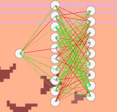

# 🧬 EvoPendulum: Neuroevolution with Chaotic Pendulums

A project simulating artificial life where a population of agents, controlled by neural networks, learns to dodge chaotic double pendulums!

## 🎮 Try it in your Browser!

The easiest way to see the project in action is through the WebGL build:

**[https://asaezs.github.io/EvoPendulum/](https://asaezs.github.io/EvoPendulum/)**

---

## 📸 Showcase

| Real-Time Simulation | Neural Network Visualizer |
| :---: | :---: |
|  |  |
| Agents (capsules) learning to survive in the environment. | Real-time visualization of the "brain" (weights and biases) of the fittest agent. |

---

## ✨ Key Features

This project was an exercise in building a **Neuroevolution** system (a simplified NEAT) entirely from scratch in C# within Unity, without relying on external libraries like ML-Agents.

* **Fully Custom AI:** The `NeuralNetwork` and `GeneticAlgorithmManager` classes were programmed from the ground up.
* **Neuroevolution:** Each agent's "genes" are the **weights and biases** of its neural network. The population evolves over generations to find the optimal weights for survival.
* **Chaotic Environment:** The agents do not face a predictable pattern. The challenge consists of two **double pendulums** (`HingeJoint2D`) whose movement is physically chaotic, forcing the AI to be reactive and predictive.
* **Real-Time Brain Visualizer:** A custom UI that renders the neural network of the current generation's fittest agent. The thickness and color of the lines (connections) represent the weight's value (gene), allowing you to *see* how the AI "thinks" and which connections become more important.
* **2D Physics Simulation:** Uses Unity's 2D physics engine (`Rigidbody2D`, `HingeJoint2D`, `Colliders`, and `Triggers`) to manage all movement and collisions.

---

## 🛠️ How It Works

The simulation is based on the interaction of three main components:

### 1. The Agent (The "Brain")
Each agent (the capsule) has its own `NeuralNetwork` instance.

* **Inputs (Senses):** The network has **9 input neurons**:
    * `1` for the agent's own X-position.
    * `4` for the first pendulum (X-position and X-velocity of its two bobs).
    * `4` for the second pendulum (X-position and X-velocity of its two bobs).
* **Hidden Layer:** A dense layer of 5 neurons (configurable).
* **Output (Action):** The network has **1 output neuron** (with `Tanh` activation).
    * A value of `-1` means "maximum force to the left".
    * A value of `+1` means "maximum force to the right".

### 2. The Environment (The Challenge)
* The "floor" and "walls" are standard `BoxCollider2D`s. If an agent touches them, it dies.
* The **Double Pendulums** are prefabs built with `Rigidbody2D` and `HingeJoint2D`.
* The danger bobs (at the end) have their colliders set to **`Is Trigger = true`**. This allows them to "kill" the agent (`OnTriggerEnter2D`) without transferring physical force that would disrupt the simulation.

### 3. The Trainer (The Genetic Algorithm)
A "Manager" `GameObject` controls the evolutionary life cycle:

1.  **Evaluation (Fitness):** Each agent runs. Its `fitness` is simply the time it survives (`Time.timeSinceLevelLoad`).
2.  **Selection:** When all agents in a generation have died, the Manager sorts them by `fitness`.
3.  **Reproduction (Crossover):** A new population is created.
    * **Elitism:** The top 10% of agents (the "champions") are cloned directly into the next generation.
    * **Crossover:** The remaining 90% are "children" created by crossing the genes (weights and biases) of the best parents from the previous generation.
4.  **Mutation:** Each "gene" (weight/bias) of a new child has a small chance to "mutate," changing its value randomly. This introduces new variety into the population.
5.  **Repeat:** The new generation is instantiated, and the cycle begins again.

---

## 💻 Tech Stack

* **Engine:** Unity 2022.x (or newer)
* **Language:** C#
* **Physics:** Unity Physics 2D (`Rigidbody2D`, `HingeJoint2D`)
* **Visualization:** Unity UI (`Canvas`, `Image` for the network visualizer)
* **Platform:** WebGL (for the online demo)
